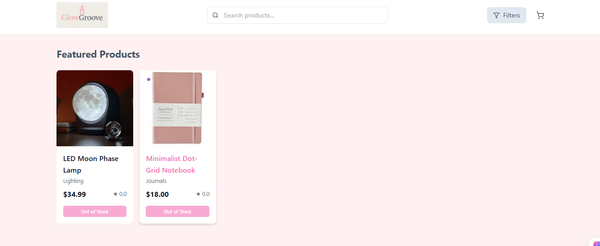

# 🌟 GlowGroove E-commerce Store

*Glow up your space. Groove up your mood.*

A modern, aesthetic e-commerce mini store built with React, Node.js, and MongoDB. GlowGroove specializes in lifestyle products including candles, journals, diffusers, LED lights, and wellness items.

## 🎨 Brand Identity

- **Target Audience**: Young adults, home décor lovers, wellness-focused shoppers
- **Design Style**: Elegant & Soft
- **Color Palette**: Soft rose, pink accents, slate text

## 🛠️ Tech Stack

### Frontend
- React 18 with TypeScript
- Tailwind CSS for styling
- React Router for navigation
- Axios for API calls
- Context API for state management

### Backend
- Node.js with Express
- MongoDB with Mongoose
- JWT for authentication
- bcryptjs for password hashing
- CORS for cross-origin requests

## 📁 Project Structure

```
glowgroove-store/
├── client/                 # React frontend
│   ├── src/
│   │   ├── components/     # Reusable UI components
│   │   ├── pages/          # Page components
│   │   ├── context/        # Context providers
│   │   ├── hooks/          # Custom hooks
│   │   ├── utils/          # Utility functions
│   │   └── assets/         # Images, icons, etc.
│   └── public/             # Static files
├── server/                 # Node.js backend
│   ├── controllers/        # Route handlers
│   ├── models/             # Database models
│   ├── routes/             # API routes
│   ├── middleware/         # Custom middleware
│   ├── config/             # Configuration files
│   └── server.js           # Main server file
└── README.md
```

## 🚀 Getting Started

### Prerequisites
- Node.js (v16 or higher)
- MongoDB (local installation or MongoDB Atlas)
- npm or yarn

### Installation

1. **Clone the repository**
   ```bash
   git clone https://github.com/Yaseeru/glowgroove.git
   cd glowgroove-store
   ```

2. **Install server dependencies**
   ```bash
   cd server
   npm install
   ```

3. **Install client dependencies**
   ```bash
   cd ../client
   npm install
   ```

4. **Set up environment variables**
   - Copy `.env.example` to `.env` in the server directory
   - Update the MongoDB URI and other configuration values

5. **Start the development servers**
   
   **Backend (Terminal 1):**
   ```bash
   cd server
   npm run dev
   ```
   
   **Frontend (Terminal 2):**
   ```bash
   cd client
   npm start
   ```

6. **Open your browser**
   - Frontend: http://localhost:3000
   - Backend API: http://localhost:5000

## 📦 Featured Products

- **Soothing Scented Candle** - Lavender + sandalwood blend ($18.00)
- **Aesthetic Journal Set** - 2 hardcover journals ($22.00)
- **Mini Essential Oil Diffuser** - USB-powered with LED glow ($28.00)
- **Moon Lamp LED Light** - Touch-controlled and rechargeable ($25.00)
- **Mindfulness Card Deck** - 40 reflection cards ($15.00)

## 🌟 Features

- [x] Product catalog with search and filtering
- [x] Shopping cart functionality
- [x] User authentication (register/login)
- [x] Order management
- [x] Responsive design
- [x] Admin dashboard for product management
- [x] Payment integration (Stripe/PayPal)
- [x] Email notifications
- [x] Product reviews and ratings

## 🎯 Pages

1. **Homepage** - Hero section with featured products
2. **Products** - Full product catalog with filters
3. **Product Details** - Individual product pages
4. **Cart** - Shopping cart management
5. **Checkout** - Order placement (mock payment)
6. **About** - Brand story and mission

## 🧪 Development

### Available Scripts

**Server:**
- `npm run dev` - Start development server with nodemon
- `npm start` - Start production server
- `npm run seed` - Seed database with sample data

**Client:**
- `npm start` - Start development server
- `npm run build` - Build for production
- `npm test` - Run tests

### Code Style
- ESLint for code linting
- Prettier for code formatting
- Conventional Commits for commit messages

## 📸 Screenshots



## 🚀 Deployment

### Frontend (Netlify)
1. Build the React app: `npm run build`
2. Deploy the `build` folder to your hosting platform

### Backend (Heroku/Railway)
1. Set up environment variables on your hosting platform
2. Deploy the server directory
3. Ensure MongoDB Atlas is configured for production

## 🤝 Contributing
1. Fork the repository
2. Create a feature branch (`git checkout -b feature/amazing-feature`)
3. Commit your changes (`git commit -m 'Add some amazing feature'`)
4. Push to the branch (`git push origin feature/amazing-feature`)
5. Open a Pull Request


## 👨‍💻 Abdulhamid A.S

Built with ❤️ for modern lifestyle enthusiasts.

---

*Ready to glow up your e-commerce game? Let's get started!* ✨